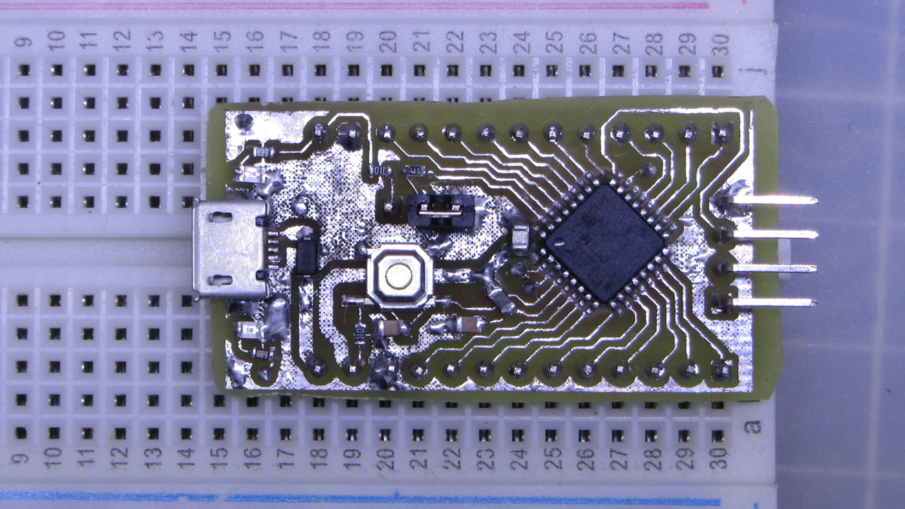
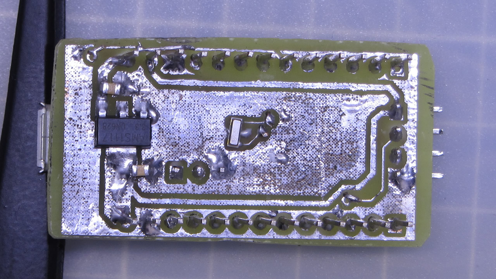

# rSTM32F030K6 ProMini





## Install
- This requires the [STM32 core for arduino](https://github.com/stm32duino/Arduino_Core_STM32/), the ST original.
- I used this [guide to add the board](https://github.com/stm32duino/wiki/wiki/Add-a-new-variant-(board)), you can check it or continue with my suggestions to install the new board.
- Copy the **"DEMO_F030K6"** folder to the Arduino **"variants"** folder, in win7 is located at: **c:\Users\\<USERNAME\>\AppData\Local\Arduino15\packages\STM32\hardware\stm32\1.6.1\variants**
- Edit the **"boards.txt"** file, in win7 is located at a lever up than the "variants" folder, search for the **F030F4** board and add the lines to leave as I show you next:
```
# DEMO_F030F4 board
# Support: Serial1 (USART1 on PA3, PA2)
GenF0.menu.pnum.DEMO_F030F4=STM32F030F4 Demo board
GenF0.menu.pnum.DEMO_F030F4.upload.maximum_data_size=4096
GenF0.menu.pnum.DEMO_F030F4.upload.maximum_size=16384
GenF0.menu.pnum.DEMO_F030F4.build.mcu=cortex-m0
GenF0.menu.pnum.DEMO_F030F4.build.board=DEMO_F030F4
GenF0.menu.pnum.DEMO_F030F4.build.series=STM32F0xx
GenF0.menu.pnum.DEMO_F030F4.build.product_line=STM32F030x6
GenF0.menu.pnum.DEMO_F030F4.build.variant=DEMO_F030F4
GenF0.menu.pnum.DEMO_F030F4.build.cmsis_lib_gcc=arm_cortexM0l_math

# DEMO_F030K6 board
# Support: Serial1 (USART1 on PA3, PA2)
GenF0.menu.pnum.DEMO_F030K6=STM32F030K6 Demo board
GenF0.menu.pnum.DEMO_F030K6.upload.maximum_data_size=4096
GenF0.menu.pnum.DEMO_F030K6.upload.maximum_size=32768
GenF0.menu.pnum.DEMO_F030K6.build.mcu=cortex-m0
GenF0.menu.pnum.DEMO_F030K6.build.board=DEMO_F030K6
GenF0.menu.pnum.DEMO_F030K6.build.series=STM32F0xx
GenF0.menu.pnum.DEMO_F030K6.build.product_line=STM32F030x6
GenF0.menu.pnum.DEMO_F030K6.build.variant=DEMO_F030K6
GenF0.menu.pnum.DEMO_F030K6.build.cmsis_lib_gcc=arm_cortexM0l_math
```

## Files and Folders description

- **DEMO_F030K6** it's the variant board for the STM32 Arduino Core.
- **gerbers** it's the PCB gerbers.
- **rSTM32F030K6T6** it's the KiCAD 5.1.2 project.
- **Schematic.pdf** as in the name.




## Running some tests

[](https://www.youtube.com/watch?v=J8X1p-aLzaY)

[](https://www.youtube.com/watch?v=zFgptjPR0z0)

## Reducing the size of your sketch

For some reason it seems that the sketchs for this platform gets way too fat (relative to standard arduino-atmel sketch sizes) and on some cases won't fit well on our board, a way to fit the sketchs to the flash/ram size that this board has it's to create a file **hal_conf_extra.h** on the sketch folder and disabling all features that weren't using:

```
#define HAL_ADC_MODULE_DISABLED
#define HAL_I2C_MODULE_DISABLED
#define HAL_RTC_MODULE_DISABLED
#define HAL_SPI_MODULE_DISABLED
#define HAL_TIM_MODULE_DISABLED
#define HAL_DAC_MODULE_DISABLED
#define HAL_EXTI_MODULE_DISABLED
#define HAL_ETH_MODULE_DISABLED
#define HAL_SD_MODULE_DISABLED
#define HAL_QSPI_MODULE_DISABLED
```
_(an arduino restart may be required on changes to this file)._

Also, if you aren't using the serial you cand disable it on the arduino menu:

**Board > U(S)ART Support > Disabled.**


## Notes

This it's the first board variant I made, so errors may occur.

[STM32Duino thread.](http://www.stm32duino.com/viewtopic.php?f=30&p=55201)
